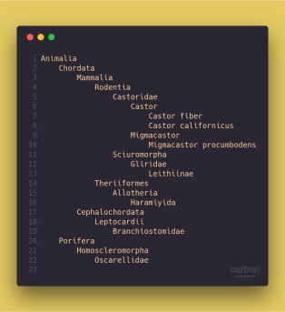

# Indents


A small library to help you parse and generate indented strings.

[ ](https://app.codeship.com/projects/316012) [](https://www.codefactor.io/repository/github/hioi/indents)

## Indented strings vs YAML
YAML is a full-featured markup language, while indented strings have only two base datatypes: Object node and string/int/float.\
Indented strings are great for:
+ Taxonomic data
+ Directory structure
+ Lists

But YAML would be a better choice, if you need to store:
+ Configuration file
+ Complicated data

## Usage
## Installing
```bash
composer require maximizer/indents
```
### Parsing
```php
<?php
use Maximizer\Indentations\Indents;
$parser = new Indents;
$parser->parseFromFile("myFile.xis", Indents::TO_ASSOC);
$parser->parseFromString("", Indents::TO_ASSOC);
```
### Generating
```php
<?php
use Maximizer\Indentations\IndentGenerator;
$array = [
    "root" => [
        "a",
        "b",
        "c" => ["d", "e"],
    ],
];

$gen = new IndentGenerator;
$gen->generate($array);
```

# License
ISC License
